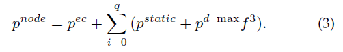
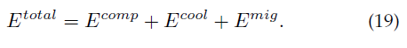

# On-Demand Capacity Provisioning in Storage Clusters Through Workload Pattern Modeling

注重效率，但能耗很高

## 概念

多台单服务器队列

4种队列模型

## 模型

能源效率和面向QoS的容量定期供应机制（Energy-efficient and QoS-oriented capacity Periodical provisioning mechanism (EQP)）

选择队列模型的依据

---

# Thermal-Aware and DVFS-Enabled Big Data Task Scheduling for Data Centers

注重节能，效率不知，数据中心处理

## 概念

- 动态电压及频率调度（DVFS，dynamic voltage and frequency scaling）
- 张量（Tensor），多维向量

## 模型

每个节点的能耗

刀片服务器分配数量矩阵（C）以及对应运行频率矩阵（F），三维分别对应任务（Task, range(1...P)）、服务器节点（Node, range(1...N)）以及时间块（Timeslot range(1...L)）

能耗方程

模拟退火算法

## 疑问

论文中的冷却耗能是根据运行服务器所产生的热量计算的，而这个热量文中直接使用了机器运行所需的能量。